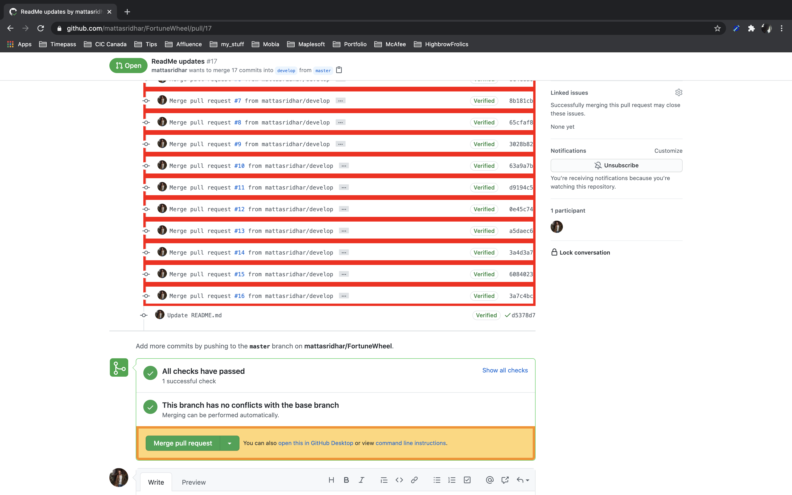

  

 
<h2>Rulextension :</h2>
<b>An Extension that checks and verifies for the rules specified for the Github pages.</b>

TABLE OF CONTENTS

 <pre> INTRODUCTION </pre>
<pre> SPECIFICATIONS </pre>
<pre> SOFTWARES REQUIRED </pre>
<pre> SOURCE CODE </pre>
<pre> INSTALLATION NOTES </pre>
<pre> ABOUT THE APPLICATION </pre>

INTRODUCTION\
 An Extension that plots and displays the Covid-19 information in a pocket-sized view in the Browser [Chrome].
  

SPECIFICATIONS

 <pre>A Chrome browser extension which accepts a RULE and then highlights the commit messages which do not satisfy the Rule:</pre>
<ul>
<li> Display an input area "Rule:" in the Top to allow user to provide the Rule to be verified.</li>
<li> Display a checkbox to check for Squashing the commits before merging the PR.</li>
<li> Display a SETTINGS button to allow user to update the Commit Div IDs information.</li>
<li> Display an input area "Commit tag ID [Commits Tab]:" to allow user to provide the ID of commit name incase it were ever to change.</li>
<li> Display an input area "Commit tag ID [Conversation Tab]:" to allow user to provide the ID of commit name incase it were ever to change.</li>
<li> Display a SAVE button to allow user to update the information.</li>
<li> Display a Back button to allow user to go navigate back from the settings page.</li>
</ul>
<pre>When the exxtension loads:</pre>
<ul>
<li> Show the input area for user to provide the 'Rule'.</li>
<li> Show the checkbox for user to provide the option to Squash the commits before morging the changes.</li>
<li> Show the "Save" button.</li>
<li> Show the "Settings" button on top right corner.</li>
</ul>
<pre>When the User clicks the "Save" icon:</pre>
<ul>
<li> Reload the page.</li>
<li> Check the page elements and highlight the Commit messages which fail to abide by the Rule specified.</li>
</ul>
<pre>When the User clicks the "Settings" icon:</pre>
<ul>
<li> Display input areas to provide the Commit div IDs for the 'Commits' tab and the 'Conversation' tab.</li>
<li> Display the 'Save' button.</li>
</ul>
<pre>When the User clicks the "Back" icon:</pre>
<ul>
<li> Display the page where the Rule can be provides.</li>
</ul>

SOFTWARES REQUIRED\
 The software that are needed for the application to be edited or executed

<ul>
<li> OPERATING SYSTEM UTILIZED: MAC OS- Catalina </li>
<li> ‘technology’ --> javascript</li>
</ul>

SOURCE CODE\
 The Source code for the application is in the 'Rulextension' folder

<ul>
<li> 'assets' --> Has all the Images and GIFs needed for the extension.</li>
<li> 'scripts' --> Has the script files needed by the background process of the extension, script files needed by the the extension to handle the content of the pages in the browser Tab and the script files needed for handling the Extension UI.</li>
<li> 'customStyles' --> Has the CSS files for handling the styles of the UI.</li>
<li> 'pages' --> Has the HTML files.</li>
</ul>

INSTALLATION NOTES\
 All the execution of this application will be done upon. <b>NO EXECUTION COMMANDS REQUIRED!</b>

<ol type="A">
<li> `Rulextension Application’ </li>
	<ul>
		<li> Enable Developer mode by navigating into 'chrome://extensions'.</li>
		<li> Click on the <b>'Load unpacked'</b> button.</li>
		<li> Navigate into your /Rulextension/ directory and click 'Select' button </li>
	</ul>
	</ol>

ABOUT THE APPLICATION\
 This application opens up a popup window after you have loaded the extension following the steps specified in the ‘INSTALLATION NOTES’ section.

The application loads and opens up a popup window with only the "Rule" input textbox displayed. Figure 1 shows the screen when the extension is clicked.

    Figure 1: Start-up Screen

    Figure 2: Display of the UI while the Settings icon is clicked.

    Figure 3: Display of the Page UI after a Rule is Checked.
